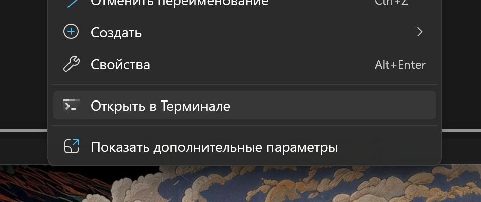
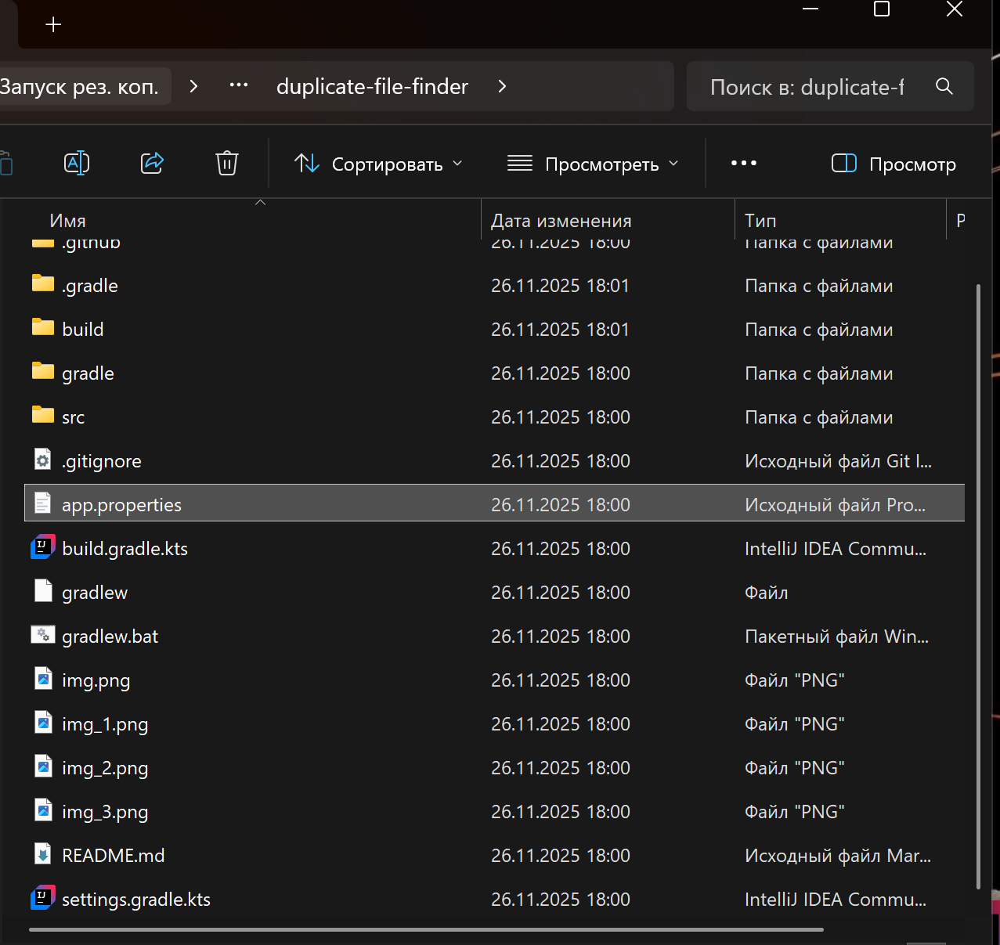
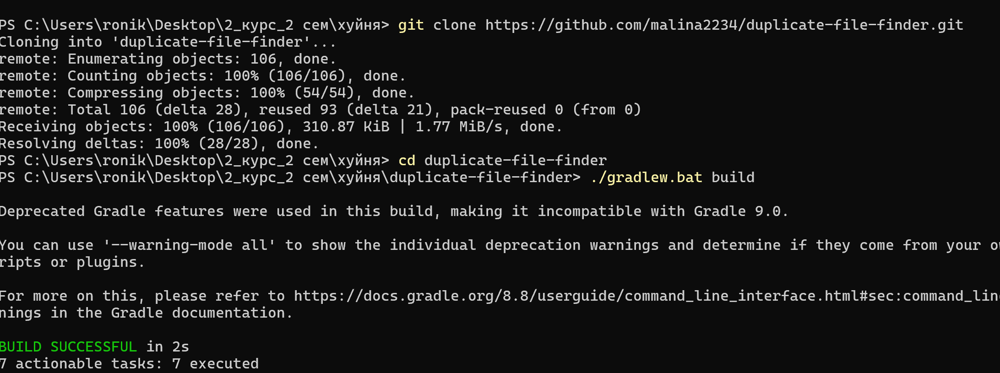
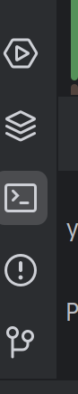
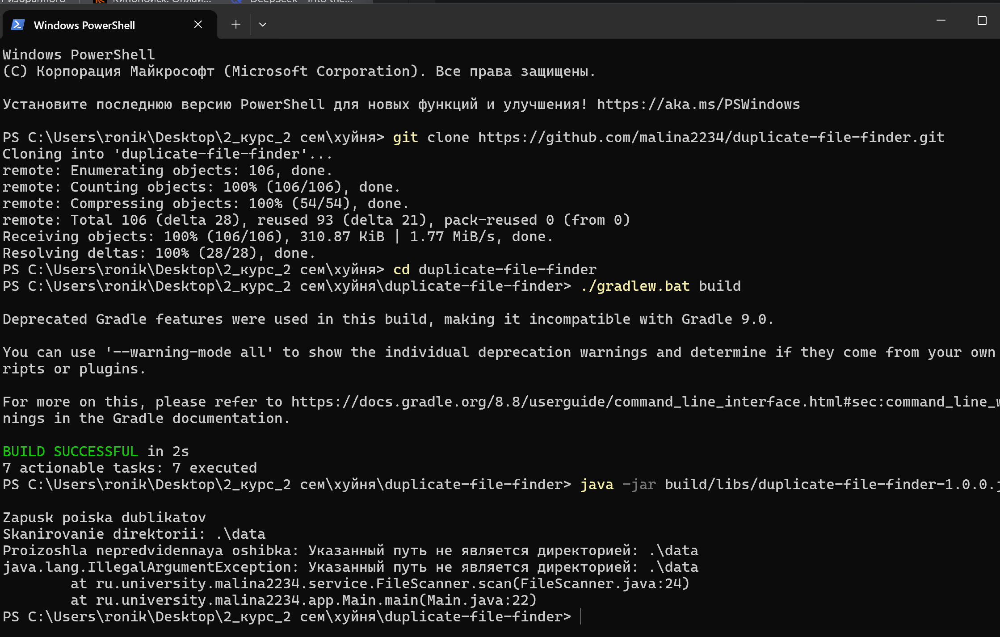

# Поиск дубликатов файлов (Duplicate File Finder)

## 1. Краткое описание проекта

### Назначение
Это консольное Java-приложение, предназначенное для рекурсивного сканирования указанной директории и поиска файлов-дубликатов. Идентификация дубликатов происходит путем сравнения их хэш-сумм, с предварительной оптимизацией через группировку по размеру.

Проект разработан в рамках лабораторной работы №3 по теме Автоматизация сборки, тестирования и развертывания программного обеспечения в системе CI/CD.

### Технологический стек
*   **Язык:** Java 17
*   **Система сборки:** Gradle
*   **Тестирование:** JUnit 5
*   **CI/CD:** GitHub Actions

---

## 2. Пример работы

### Входные данные
Для демонстрации работы необходимо создать структуру папок и файлов. Например, в директории `data`:

data/

├── archive/

│ └── photo_backup.jpg (копия photo.jpg)

├── документ.txt

├── документ_копия.txt (копия документ.txt)

├── photo.jpg

└── unique_file.txt (уникальный файл)

### Вывод в консоль
После запуска приложение выведет отчет о найденных группах дубликатов:
```bash
Запуск поиска дубликатов
Сканирование директории: ./data
Найдено файлов для анализа: 5

 Найдены дубликаты 

Группа 1 (Хэш: ed076287532e86365e841e92bfc50d8c):
 - C:\path\to\project\data\документ.txt
 - C:\path\to\project\data\документ_копия.txt

Группа 2 (Хэш: d41d8cd98f00b204e9800998ecf8427e):
 - C:\path\to\project\data\archive\photo_backup.jpg
 - C:\path\to\project\data\photo.jpg
```


## 3. Сборка и запуск: Пошаговое руководство

Это руководство поможет вам скачать, настроить и запустить проект на вашем компьютере.

### Шаг 0: Предварительные требования

Перед началом убедитесь, что на вашем компьютере установлены:

1.  **Java Development Kit (JDK) версии 17 или новее.**
   *   *Как проверить?* Откройте терминал (командную строку)  ( кнопка windows + R , и в открывшемся окне ввести cmd ) и введите `java -version`. Если версия 17 или выше, все отлично.
   *   *Где скачать?* Рекомендуется [Adoptium Temurin 17 (LTS)](https://adoptium.net/temurin/releases/?version=17).


### Шаг 1: Скачивание (клонирование) проекта

1. Создайте папку под любым названием, в любом месте, после создания перейдите в нее, в эьу папку будем клонировать наш проект ( потом в этой папке нажать на правую клавишу тачпада и открыть терминал).


3.  Выполните команду `git clone`, чтобы скопировать проект с GitHub ( просто скопируйте с этого поля текст):
    ```bash
    git clone https://github.com/malina2234/duplicate-file-finder.git
    ```
4.  В этом же терминале выполните.  **Все дальнейшие команды выполняются с этого терминала.** Не закрывайте этот терминал, потому что он еще нам будет нужен 
    ```bash
    cd duplicate-file-finder
    ```

### Шаг 2: Настройка 

Проекту для работы нужен конфигурационный файл и папка с данными.

1.  **Создайте файл конфигурации `app.properties`** зайдя в скаченную папку `duplicate-file-finder` нажмите находясь в этой папке добавить файл и добавьте файл с этим названием `app.properties`( ЕСЛИ КАКИМ-ТО ОБРАЗОМ НЕ ПОЛУЧИЛСЯ ТОТ СПОСОБ, ПРОБУЙТЕ ЭТОТ:  это можно сделеть открыв приложение Indelig Idea и открыть там скаченный проект, нажав правой клавишей на тачпаде  на верхнюю строку с названием duplicate-file-finder и там будет `добавить файл` и добавляем файл с названием `app.properties`)

вот тут должен быть создан файл 


   **После того как создали файл , скопируйте этот текст и вставьте туда и после этого сохраните файл!** : 

    ```properties
    # Папка для сканирования (относительно корня проекта).
    scan.directory=./data

    # Алгоритм хеширования: можно MD5 или SHA-256.
    hash.algorithm=MD5

    # Папки, которые нужно игнорировать.
    scan.ignore.dirs=target,.git,build
    ```

2.  **Создайте папку `data` ( можно таким же способом, зайдя в проводнике все также в нашу папку `duplicate-file-finder` нажмите там создать папку и назовите `data`) это папка нужна для поиска дубликатов. ( если не получилось так , то можно сдлеать через программу intell idea создав там эту папку в проекте , но тот способ лечге ! )**
   *   Поместите в нее несколько любых одинаковых файлов, изменив названия ( можно две одинаковые картинки) . **Обязательно создайте одинаковые файлы**, чтобы программа нашла дубликаты.

### Шаг 3: Сборка проекта

Теперь нужно скомпилировать Java-код в исполняемый файл. Проект использует Gradle Wrapper, поэтому вам не нужно ничего устанавливать дополнительно.
    
#### Все в том же открытом терминале , где мы клонировали репозиторий и добавляли путь в папку 



ВСТАВЬТЕ ЭТУ КОМАНДУ : 

скопируйте и вставьте эту команду :
*   **На Windows:**
    ```bash
    ./gradlew.bat build
    ```
*   **На macOS или Linux:**
    ```bash
    ./gradlew build
    ```

### Если делали через приложения:
 Эту команду можно ввести в терминале приложения нажав на третий виджет.



скопируйте и вставьте эту команду :
*   **На Windows:**
    ```bash
    ./gradlew.bat build
    ```
*   **На macOS или Linux:**
    ```bash
    ./gradlew build
    ```
Дождитесь сообщения `BUILD SUCCESSFUL`. Это может занять некоторое время при первом запуске.

### Шаг 4: Запуск приложения

После успешной сборки в проекте появится папка `build/libs`. Внутри нее находится готовый `.jar` файл.

1. Запустите приложение через терминал, который все также открыт с помощью команды ( терминал после этого еще не надо закрывать):

    ```bash
    java -jar build/libs/duplicate-file-finder-1.0.0.jar
    ```
вот тут если что : 


**Если делали через приложения**, то введите команду в том терминале, который был показан на прошлой фотографии
 

**Готово!** В консоли вы увидите отчет о найденных дубликатах в вашей папке `data`.

---

## 4. Запуск тестов

Проект покрыт тестами для проверки корректности основной логики. Чтобы запустить их, выполните команду:

Можео выполнить в том терминале, который мы открыли в папке или в терминале приложения 

*   **На Windows:**
    ```bash
    ./gradlew.bat test
    ```
*   **На macOS или Linux:**
    ```bash
    ./gradlew test
    ```
После успешного выполнения вы можете найти детальный HTML-отчет в файле `build/reports/tests/test/index.html`.

---
 
## ТЕПЕРЬ ВСЁ