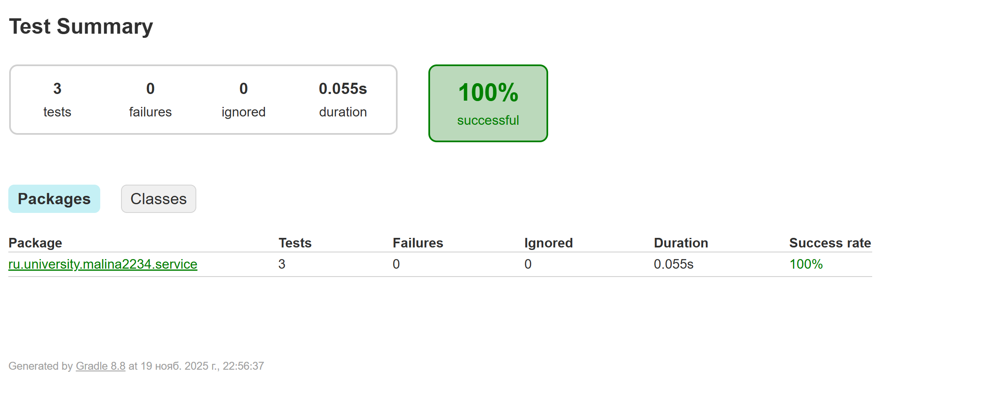

# Поиск дубликатов файлов (Duplicate File Finder)

## 1. Краткое описание проекта

### Назначение
Это консольное Java-приложение, предназначенное для рекурсивного сканирования указанной директории и поиска файлов-дубликатов. Идентификация дубликатов происходит путем сравнения их хэш-сумм, с предварительной оптимизацией через группировку по размеру.

Проект разработан в рамках лабораторной работы №3 по теме Автоматизация сборки, тестирования и развертывания программного обеспечения в системе CI/CD.

### Технологический стек
*   **Язык:** Java 17
*   **Система сборки:** Gradle
*   **Тестирование:** JUnit 5
*   **CI/CD:** GitHub Actions

---

## 2. Пример работы

### Входные данные
Для демонстрации работы необходимо создать структуру папок и файлов. Например, в директории `data`:

data/

├── archive/

│ └── photo_backup.jpg (копия photo.jpg)

├── документ.txt

├── документ_копия.txt (копия документ.txt)

├── photo.jpg

└── unique_file.txt (уникальный файл)

### Вывод в консоль
После запуска приложение выведет отчет о найденных группах дубликатов:
```bash
Запуск поиска дубликатов
Сканирование директории: ./data
Найдено файлов для анализа: 5

 Найдены дубликаты 

Группа 1 (Хэш: ed076287532e86365e841e92bfc50d8c):
 - C:\path\to\project\data\документ.txt
 - C:\path\to\project\data\документ_копия.txt

Группа 2 (Хэш: d41d8cd98f00b204e9800998ecf8427e):
 - C:\path\to\project\data\archive\photo_backup.jpg
 - C:\path\to\project\data\photo.jpg
```

Конечно! Создание хорошей документации — это финальный и очень важный штрих. Хороший README.md файл — это лицо вашего проекта.
Вот готовый текст для вашего файла README.md. Он полностью соответствует структуре, требуемой в задании, и содержит всю необходимую информацию, основанную на нашей с вами работе.
Инструкция
В корневой папке вашего проекта в IntelliJ IDEA нажмите правой кнопкой мыши -> New -> File.
Назовите файл README.md.
Скопируйте и вставьте в него весь текст, который находится ниже.
Сделайте финальный коммит и отправьте его на GitHub.
Содержимое для README.md
code
Markdown

 
## 3. Сборка и запуск
* Требования
JDK 17 или выше. Убедитесь, что у вас установлен именно JDK (Java Development Kit).
Git для клонирования репозитория.
Конфигурация проекта
Все настройки приложения находятся в файле app.properties, который должен быть создан в корневой директории проекта.

* Важно: Этот файл находится в .gitignore и не хранится в репозитории, поэтому его необходимо создать вручную.
```bash
* Пример app.properties:

# Директория для сканирования относительно корня проекта
scan.directory=./data

# Алгоритм хэширования. Доступные варианты: MD5, SHA-256
hash.algorithm=MD5

# Исключить директории из сканирования (имена через запятую, без пробелов)
scan.ignore.dirs=target,.git,build
```
## Сборка проекта
Для сборки проекта используйте Gradle Wrapper. Откройте терминал в корневой папке проекта и выполните команду:

```bash 
./gradlew build
```
В случае успеха вы увидите сообщение BUILD SUCCESSFUL.

## Запуск приложения
Приложение можно запустить двумя способами:
1. Через Gradle (рекомендуется для разработки):
   Убедитесь, что файл app.properties настроен, и выполните команду:

```bash
./gradlew run
```
 
## Запуск тестов 
```bash
./gradlew test
```
В случае успеха вы увидите сообщение `BUILD SUCCESSFUL`. Детальный отчет о прохождении тестов можно найти в файле `build/reports/tests/test/index.html`.



### Запуск приложения
Приложение можно запустить двумя способами:

**1. Через Gradle (рекомендуется для разработки):**
Убедитесь, что файл `app.properties` и папка с данными (`data`) существуют и настроены. Затем выполните команду:

```bash
./gradlew run
```

---

### **Что делать дальше: Финальные шаги**

Теперь, когда у вас есть готовый `README.md`, вам осталось сделать всего несколько простых действий, чтобы завершить работу.

1.  **Создайте или обновите файл `README.md`:**
   *   В корне вашего проекта создайте файл `README.md` (если его еще нет).
   *   Сохраните файл.

2.  **Сделайте финальный коммит:**
   *   Откройте вкладку "Commit" в IntelliJ IDEA.
   *   Вы увидите, что файл `README.md` был добавлен или изменен.
   *   Напишите сообщение для коммита.
   *   Нажмите **"Commit and Push"**.

3.  **Проверьте GitHub:**
   *   Зайдите на страницу вашего репозитория на GitHub.
   *   Вы должны увидеть, что под списком файлов теперь красиво отображается ваша новая документация.
   *   Зайдите во вкладку **Actions** и убедитесь, что ваш последний коммит (с документацией) также запустил CI/CD пайплайн и он успешно завершился (зеленая галочка). 

## ТЕПЕРЬ ВСЁ